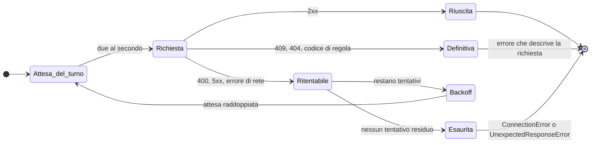

# L'affidabilità

Il servizio è di terzi, gratuito, senza livelli di servizio garantiti e senza
quote pubblicate. Può rallentare, rispondere male o non rispondere affatto.

## Verso il servizio

**Due richieste al secondo, serializzate.** Il servizio non pubblica quote e
non restituisce header di rate limit, quindi non esiste un limite ufficiale da
rispettare: si sa solo che sotto raffica smette di rispondere e chiede di
riprovare più tardi. Due al secondo è il valore prudente scelto da questa
libreria, non un limite imposto da Normattiva, e puoi cambiarlo se il tuo caso
lo giustifica:

```python
Normattiva(requests_per_second=5.0)
Normattiva(requests_per_second=0)  # nessun limite
```

**Uno User-Agent identificante.** Chi riceve il traffico deve poter capire chi
sei e come contattarti:

```python
Normattiva(user_agent="il-mio-servizio/1.2 (+https://esempio.it/contatti)")
```

Il rate limiter è thread-safe, e la sua controparte asincrona usa un
`asyncio.Lock`. Un client condiviso corrisponde a un solo budget di richieste
verso il servizio.

!!! trappola "Il limite vale per client, non per programma"

    Creando un client per chiamata, il rate limiting non limita più nulla: ogni
    client applica il proprio budget senza sapere degli altri.

## I retry

`retries` è il numero di tentativi in tutto, il primo compreso: il predefinito
3 vuol dire due nuovi tentativi dopo quello iniziale. Fra un tentativo e il
successivo la libreria attende, e l'attesa raddoppia ogni volta a partire da
mezzo secondo, più un po' di scarto casuale e con un tetto a otto secondi.



Che cosa viene ritentato non dipende dal solo codice di stato, perché in questo
servizio il codice di stato è poco informativo:

| Risposta | Ritentata? | Perché |
|---|---|---|
| `400` | **sì** | il servizio non è deterministico: la stessa lettura può dare 200 al secondo tentativo |
| `500`, `502`, `503`, `504` | **sì** | guasto del servizio |
| `409` | no | è lo strato di protezione che rifiuta la forma della richiesta |
| `4xx` con un codice di regola noto | no | descrive la richiesta: ripeterla non cambia niente |
| errore di rete | **sì** | connessione azzerata, timeout |

Tutte le chiamate che la libreria fa sono **letture**, quindi ripeterle è
sicuro: non ci sono scritture che rischino di essere duplicate.

```python
Normattiva(retries=1)  # un tentativo solo, nessun ritentativo
Normattiva(timeout=60.0)  # per gli export lenti
```

Quando i tentativi si esauriscono, l'errore dipende da come il servizio ha
risposto:

| Cosa è arrivato | Errore finale |
|---|---|
| niente: connessione azzerata, timeout | `ConnectionError: il servizio non risponde: connessione azzerata` |
| un `5xx` con un codice noto nel corpo | `ConnectionError: il servizio ha risposto 500: Errore generico, riprovare piu' tardi` |
| un `5xx` senza codice riconoscibile | `UnexpectedResponseError: il servizio ha risposto 500: Internal Server Error` |

Le risposte che non vengono ritentate diventano subito l'errore che le
descrive:

| Cosa è arrivato | Errore |
|---|---|
| `404` con il corpo applicativo | `NotFoundError: nessun atto per la richiesta` |
| `409` dallo strato di protezione | `RequestBlockedError: la richiesta è stata respinta dai sistemi di protezione del servizio` |

!!! note "Quando il codice nel corpo cambia la decisione"

    Un `400` con `code: 1501` (intervallo oltre dodici mesi) non viene
    ritentato: quel codice descrive la richiesta. Un `500` con `code: 1000`
    invece **viene** ritentato, perché il 1000 segnala un guasto del servizio e
    arriva anche per richieste perfettamente valide.

## Osservare cosa succede

La libreria scrive log su un logger chiamato `normattiva`, a livello `DEBUG`:

```python
import logging

logging.basicConfig(level=logging.DEBUG)
logging.getLogger("normattiva").setLevel(logging.DEBUG)
```

Su una richiesta che fallisce una volta e riesce alla seconda, il log mostra:

```
DEBUG:normattiva:il servizio ha risposto 500 su https://api.normattiva.it/.../atto/dettaglio-atto-urn
DEBUG:normattiva:nuovo tentativo fra 0.51s su POST https://api.normattiva.it/.../atto/dettaglio-atto-urn
```

Il logger registra i retry e gli stati dell'esportazione. Per metriche e
tracing conviene invece iniettare il proprio client HTTP e usare gli event hook
di httpx:

```python
import httpx

Normattiva(http_client=httpx.Client(event_hooks={"response": [misura]}))
```

Un client iniettato dall'esterno non viene chiuso da `close()`: chiuderlo
spetta a chi l'ha aperto.

## Il monitoraggio

L'API di Normattiva non ha una specifica pubblicata a cui il servizio si
impegni: può cambiare senza preavviso, e la libreria smetterebbe di leggere le
risposte senza che nessuno lo sappia prima di chi la usa. Ogni notte una suite
interroga tutti e quindici gli endpoint e confronta la forma delle risposte con
un riferimento registrato; a uno scostamento si apre una issue sul repository.

La stessa suite ricontrolla le [trappole](trappole.md): non che siano state
risolte, ma che si presentino ancora nello stesso modo, perché la libreria le
gira intorno contando su quel comportamento.

Il funzionamento del meccanismo è descritto in
[Il monitoraggio del contratto](../progetto/monitoraggio.md).
