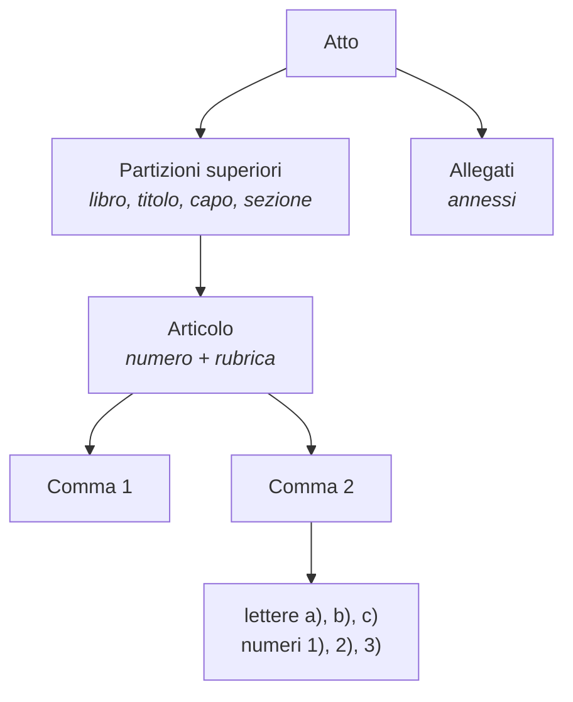
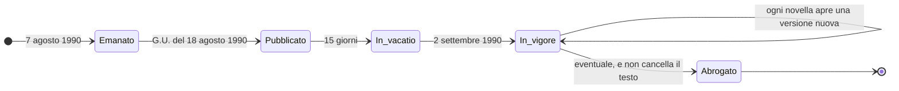

# Come è fatto un atto

I nomi che la libreria usa sono quelli del diritto italiano: atto, articolo,
comma, rubrica, allegato, vigenza. Dello stesso testo, poi, esistono più
versioni.

!!! note "Serve a leggere i dati, non a decidere una questione giuridica"

    Quello che segue serve a leggere i dati con cognizione di causa. Per le
    conseguenze giuridiche di un testo, la fonte è la Gazzetta Ufficiale e
    l'interlocutore è un giurista.

## Le coordinate di un atto

Un provvedimento si identifica con tre elementi: **che tipo di atto è**,
**quando è stato emanato** e **che numero ha**. La libreria li raccoglie in
[`EstremiAtto`][normattiva.EstremiAtto].

```python
atto.estremi.denominazione  # 'LEGGE'
atto.estremi.data  # date(1990, 8, 7)
atto.estremi.numero  # '241'
atto.estremi.citazione  # 'L. 7 agosto 1990, n. 241'
```

A questi si aggiunge un secondo gruppo, relativo alla **pubblicazione**.

La **Gazzetta Ufficiale della Repubblica Italiana** è il giornale su cui lo
Stato pubblica le leggi: un atto esiste come legge quando esce lì, e il testo
stampato in Gazzetta è l'unico ufficiale. Esce quasi ogni giorno, numerata
progressivamente per anno, e ha dei *supplementi* (ordinari e straordinari) per
i testi lunghi. Un atto si individua quindi anche dalle sue coordinate di
pubblicazione: su quale numero di Gazzetta è uscito, in che data, in quale
supplemento, e con quale codice redazionale.

```python
atto.gazzetta  # G.U. n. 192 del 1990-08-18
atto.gazzetta.codice_redazionale  # '090G0294'
```

Il **codice redazionale** è l'identificativo che l'IPZS assegna al singolo
documento pubblicato. Non è un URN e non è leggibile, ma è l'unico
identificatore disponibile per gli atti che
[una forma URN non ce l'hanno](trappole.md#dodici-tipi-di-atto-non-hanno-una-forma-urn-verificata).

## I tipi di atto

Che cosa distingue una legge da un decreto-legge, da un decreto legislativo e da
un regolamento, e come si ordinano fra loro, sta in
[Come funziona la normativa italiana](la-normativa-italiana.md#chi-produce-le-norme).
Qui basta sapere che il **tipo** fa parte dell'identità dell'atto: entra nella
citazione, nell'URN e nei criteri di ricerca.

### Le abbreviazioni

`citazione` scrive l'atto nella forma usata dai giuristi, e la libreria conosce
undici abbreviazioni:

| Denominazione | Abbreviazione |
|---|---|
| `COSTITUZIONE` | `Cost.` |
| `LEGGE` | `L.` |
| `LEGGE COSTITUZIONALE` | `L. cost.` |
| `DECRETO-LEGGE` | `D.L.` |
| `DECRETO LEGISLATIVO` | `D.Lgs.` |
| `DECRETO DEL PRESIDENTE DELLA REPUBBLICA` | `D.P.R.` |
| `DECRETO DEL PRESIDENTE DEL CONSIGLIO DEI MINISTRI` | `D.P.C.M.` |
| `DECRETO MINISTERIALE` | `D.M.` |
| `REGIO DECRETO` | `R.D.` |
| `REGIO DECRETO-LEGGE` | `R.D.L.` |
| `REGIO DECRETO LEGISLATIVO` | `R.D.Lgs.` |

Il corpus di Normattiva contiene **trenta** denominazioni, molte delle quali
storiche («decreto luogotenenziale», «decreto del capo provvisorio dello
Stato»). Diciotto hanno una forma URN verificata, undici hanno
un'abbreviazione, e le due liste non coincidono: vedi
[Identificare un atto](../come-fare/identificare-un-atto.md#citare-un-atto).

## Come è fatto dentro

Un atto è un albero. Le foglie rilevanti sono gli **articoli**, e dentro
ciascuno il testo è diviso in **commi**.



**Articolo.** L'unità numerata di cui è composto un atto. La `rubrica` è il suo
titolo, quello fra parentesi: *«Conclusione del procedimento»*. Non tutti gli
articoli ce l'hanno, e nelle versioni storiche spesso manca del tutto.

**Comma.** Il capoverso numerato dentro un articolo. Quando si cita «l'articolo
2, comma 1» si intende il primo capoverso dell'articolo 2. Nel percorso
interattivo la libreria li restituisce già separati:

```python
atto.commi[0]
# Comma(numero='1', testo="Ove il procedimento consegua obbligatoriamente ...")
```

Lo schema qui sotto mette il testo come lo stampa il servizio accanto ai campi
che lo contengono:

<div class="nrm-grafico" markdown="0">
<svg viewBox="0 0 760 300" xmlns="http://www.w3.org/2000/svg" role="img" aria-label="Il testo stampato di un articolo e i campi della libreria che lo contengono" class="nrm-figura">
  <rect x="8" y="14" width="430" height="268" rx="6" class="nrm-riquadro" />
  <text x="24" y="44" class="nrm-mono nrm-forte">Art. 2</text>
  <text x="24" y="70" class="nrm-mono">(Conclusione del procedimento)</text>
  <text x="24" y="104" class="nrm-mono">1. Ove il procedimento consegua</text>
  <text x="24" y="122" class="nrm-mono">obbligatoriamente ad un'istanza ...</text>
  <text x="24" y="156" class="nrm-mono">2. Nei casi in cui disposizioni di</text>
  <text x="24" y="174" class="nrm-mono">legge ovvero i provvedimenti ...</text>
  <text x="46" y="208" class="nrm-mono">a) alla data di entrata in vigore ...</text>
  <text x="24" y="248" class="nrm-mono nrm-tenue">((3. Nei casi in cui una legge ...))</text>
  <text x="24" y="270" class="nrm-mono nrm-tenue">$$ modificato dall'art. 7 l. 69/2009</text>

  <line x1="150" y1="38" x2="470" y2="38" class="nrm-guida" />
  <text x="478" y="42" class="nrm-etichetta">numero dell'articolo</text>
  <line x1="250" y1="64" x2="470" y2="64" class="nrm-guida" />
  <text x="478" y="68" class="nrm-etichetta">rubrica</text>
  <line x1="300" y1="112" x2="470" y2="112" class="nrm-guida" />
  <text x="478" y="102" class="nrm-etichetta">commi[0].numero = '1'</text>
  <text x="478" y="120" class="nrm-etichetta">commi[0].testo</text>
  <line x1="300" y1="165" x2="470" y2="165" class="nrm-guida" />
  <text x="478" y="169" class="nrm-etichetta">commi[1]</text>
  <line x1="320" y1="204" x2="470" y2="204" class="nrm-guida" />
  <text x="478" y="199" class="nrm-etichetta">lettera: resta dentro</text>
  <text x="478" y="215" class="nrm-etichetta">il testo del comma</text>
  <line x1="300" y1="248" x2="470" y2="248" class="nrm-guida" />
  <text x="478" y="243" class="nrm-etichetta">le doppie parentesi segnano</text>
  <text x="478" y="259" class="nrm-etichetta">il testo modificato</text>
  <line x1="300" y1="268" x2="470" y2="278" class="nrm-guida" />
  <text x="478" y="282" class="nrm-etichetta">note_aggiornamento</text>
</svg>
</div>

Le **lettere** e i **numeri** che spezzano un comma restano dentro il testo del
comma: la libreria non li separa, perché il servizio non li marca in modo
affidabile. Le **doppie parentesi** e le righe che cominciano con `$$` sono
segni redazionali di Normattiva: le prime racchiudono il testo introdotto da una
modifica, le seconde aprono le note di aggiornamento, che `DettaglioAtto` tiene
in `note_aggiornamento` invece di lasciarle dentro `testo`.

**Partizioni superiori.** Negli atti lunghi gli articoli sono raggruppati in
capi, titoli, libri, sezioni. Servono a orientarsi, non a citare: un articolo
si cita per numero, non per capo.

**Allegati.** Testi che accompagnano l'atto senza farne parte come articolato.
È qui che stanno i codici: il codice civile è l'allegato di un regio decreto,
ed è [la ragione per cui i suoi articoli non rispondono sotto il decreto stesso](../come-fare/identificare-un-atto.md#i-codici).

### Il bis, il ter, il quater

Quando una modifica inserisce un articolo nuovo fra il 2 e il 3, gli articoli
successivi non vengono rinumerati: si aggiunge un **2-bis**. Poi un 2-ter, un
2-quater, e così via con gli ordinali latini.

```python
for articolo in atto.vigente.articoli():
    print(articolo.numero, "|", articolo.rubrica)
```

```
2 | Conclusione del procedimento
2 bis | Conseguenze per il ritardo dell'amministrazione nella conclusione del procedimento.
3 | Motivazione del provvedimento
3 bis | Uso della telematica.
```

Lo stesso vale per i commi. È il motivo per cui un articolo può avere 105 commi
con l'ultimo etichettato «100», e per cui il numero di articolo è una
**stringa** e non un intero: `"416bis"` è un numero di articolo del tutto
normale.

## La vita di un atto nel tempo



Fra la pubblicazione e l'entrata in vigore passa la **vacatio legis**: quindici
giorni, salvo che la legge stessa disponga altrimenti (art. 73 Cost.). Nella
legge 241 è verificabile direttamente: pubblicata il 18 agosto 1990, la prima
finestra di vigenza del suo articolo 19 comincia il 2 settembre, quindici
giorni dopo.

Una **novella** è una modifica che un atto successivo apporta a un atto
precedente: non un testo nuovo, ma un'istruzione di sostituzione applicata al
testo esistente. È il motivo per cui la legge 241 del 1990 ha oggi 61 versioni
diverse pur restando la stessa legge.

L'**abrogazione** toglie efficacia a un atto per il futuro, senza cancellarlo:
il testo abrogato resta consultabile, e resta applicabile ai fatti avvenuti
mentre era in vigore. Per questo `AttoStorico.abrogato` è un'informazione, non
un motivo per nascondere il testo.

### Le parole della vigenza

Sono quattro, e nella libreria compaiono come nomi di campi e di parametri.

**Vigenza** è l'essere in vigore di un testo. Un testo è vigente quando produce
effetti giuridici.

**Finestra di vigenza** è il periodo in cui una certa versione di un testo è
stata quella in vigore: comincia il giorno in cui quella versione ha preso il
posto della precedente e finisce il giorno prima che un'altra la sostituisca.
Nella libreria è [`FinestraVigenza`][normattiva.FinestraVigenza], e una finestra
senza fine è quella tuttora in vigore.

**Multivigenza** è la proprietà di una banca dati che conserva tutte le versioni
succedutesi nel tempo, e non solo l'ultima. È quello che distingue Normattiva
dalla maggior parte delle raccolte normative, ed è la ragione per cui
`dettaglio` accetta una data.

**Testo originale** è la versione come è uscita in Gazzetta, prima di qualunque
modifica; nella libreria si chiede con `vigenza="originale"`.

La conseguenza pratica è che la domanda «cosa dice questo articolo» non ha
risposta senza un «quando». Come si indica la data lo mostra
[Leggere il testo a una data](../come-fare/leggere-il-testo-a-una-data.md).

## Come si cita

La forma canonica è *abbreviazione, giorno mese anno, n. numero*, seguita
dall'articolo e dal comma quando servono.

```python
from datetime import date
from normattiva import EstremiAtto

EstremiAtto("LEGGE", date(1990, 8, 7), "241").citazione
# 'L. 7 agosto 1990, n. 241'
```

Nella pratica si scrive poi *«art. 2, comma 1, l. 241/1990»*. La libreria non
compone questa forma estesa: si ferma alla citazione dell'atto, l'unica parte
per cui esiste una convenzione davvero condivisa.
