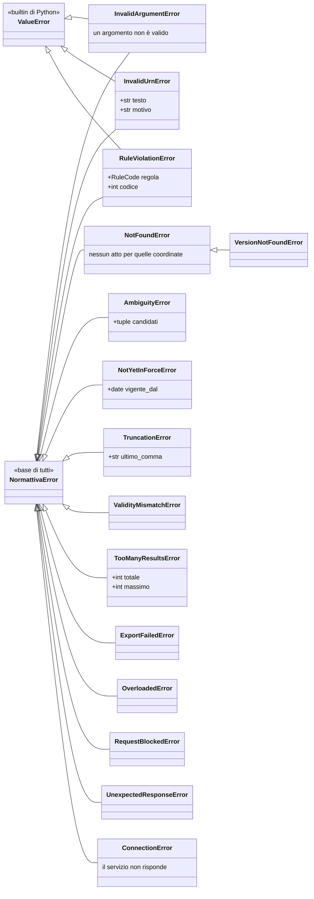

# Gli errori

Una libreria che dialoga con un servizio di terzi può fallire per due ragioni
diverse: la richiesta era sbagliata, oppure il servizio non è riuscito a
rispondere. Le due situazioni si gestiscono in modo opposto, e in questo
servizio distinguerle guardando i codici di stato HTTP non è affidabile.

Per questo la gerarchia degli errori segue una regola sola, senza eccezioni:

> Ogni errore sollevato da questa libreria discende da `NormattivaError`.
> Quelli che indicano che **la richiesta era sbagliata** discendono anche da
> `ValueError`.

Ne seguono i due `except` che coprono tutti i casi:

```python
from normattiva import NormattivaError

try:
    atto = normattiva.dettaglio(urn)
except ValueError:
    ...  # richiesta sbagliata: correggerla
except NormattivaError:
    ...  # errore del servizio, o risposta non interpretabile
```

Il secondo `except` cattura anche il primo, quindi l'ordine conta.

## La gerarchia



I tre errori in alto discendono **anche** da `ValueError`: sono quelli che
descrivono una richiesta sbagliata, e la doppia discendenza è ciò che permette
di prenderli tutti insieme con un `except ValueError` senza sapere quale strato
li ha sollevati.

## Gli errori della richiesta

Tre errori, tutti anche `ValueError`.

### `InvalidArgumentError`

Un argomento non è valido, e per stabilirlo non serve interrogare il servizio.

```python
normattiva.ricerca("procedimento", pagina=0)
# InvalidArgumentError: pagina e per_pagina partono da 1

normattiva.dettaglio(urn_con_vigenza, vigenza=date(2005, 1, 1))
# InvalidArgumentError: l'URN chiede la vigenza ... e il parametro ne chiede ...

esportazione.download()  # su un export in formato AKN
# InvalidArgumentError: il format AKN non viene letto in modelli: usare save()
```

Nessuno di questi casi genera traffico di rete.

### `InvalidUrnError`

L'URN non rispetta la grammatica NIR, oppure appartiene a un tipo di atto la
cui forma URN non è verificata.

```python
errore.testo  # quello che gli hai passato
errore.motivo  # perché non va bene, quando si sa
```

### `RuleViolationError`

La richiesta viola una regola dichiarata del servizio. In alcuni casi la
violazione è segnalata dal servizio, in altri la libreria la rileva da sola.

```python
from normattiva import RuleCode, RuleViolationError

try:
    list(normattiva.atti_aggiornati(date(2020, 6, 1), date(2020, 1, 1)))
except RuleViolationError as errore:
    errore.regola  # RuleCode.DATE_INVERTITE
    errore.codice  # 1503
```

Quando il codice non è fra quelli conosciuti, `regola` vale `None`. I codici
noti stanno in [`RuleCode`][normattiva.RuleCode].

!!! note "Descrive sempre la richiesta"

    Se il codice arriva insieme a un `5xx`, la libreria solleva
    `ConnectionError`: un `5xx` indica un problema del servizio, non della
    richiesta, e arriva anche a richieste perfettamente valide.

## Gli errori restituiti dal servizio

### `NotFoundError`

Nessun atto corrisponde a quelle coordinate. Può significare che l'atto non
esiste, oppure che l'URN è malformato in un modo che la grammatica non
intercetta, come succede agli articoli dei codici richiesti senza allegato.

### `AmbiguityError`

L'URN corrisponde a più atti. `errore.candidati` li contiene, già letti.

### `NotYetInForceError`

L'articolo non esisteva alla data richiesta. `errore.vigente_dal` indica da
quando esiste, quando il servizio fornisce l'informazione.

### `OverloadedError`

Il servizio ha rifiutato la richiesta perché sovraccarico.
`errore.descrizione` riporta la spiegazione, quando il servizio ne dà una.

### `RequestBlockedError`

Lo strato di protezione davanti all'API ha respinto la **forma** della
richiesta. Non viene mai ritentato, perché la respingerebbe di nuovo.

## Gli errori sul testo

### `TruncationError`

Sollevato solo su richiesta, con `se_troncato="solleva"`. `errore.ultimo_comma`
è l'etichetta a cui il testo si interrompe.

### `ValidityMismatchError`

Il servizio ha risposto con una versione che non copre la data richiesta. Oggi
non capita: se capitasse, il servizio avrebbe cambiato comportamento e i testi
storici già ottenuti andrebbero riguardati.

### `VersionNotFoundError`

Nessuna versione di un `AttoStorico` copre la data richiesta, di solito perché
è anteriore alla pubblicazione dell'atto. È una sottoclasse di `NotFoundError`:
un `except NotFoundError` le intercetta entrambe.

### `TooManyResultsError`

L'esportazione supererebbe il limite consentito. `errore.totale` e
`errore.massimo` riportano il costo effettivo e il limite impostato.

## Gli errori di trasporto

### `ConnectionError`

Il servizio non è raggiungibile, ha smesso di rispondere, oppure ha risposto
`5xx` con un codice che dichiara un guasto (tipicamente il `1000`) fino a
esaurire i tentativi. Ha senso riprovare più tardi.

```python
try:
    normattiva.ricerca("appalti")
except ConnectionError as errore:
    print(errore)
```

```
il servizio non risponde: connessione azzerata
il servizio ha risposto 500: Errore generico, riprovare piu' tardi
```

### `UnexpectedResponseError`

La risposta non ha la forma che la libreria sa interpretare. Copre anche un
`5xx` senza alcun codice riconoscibile, dopo che i tentativi si sono esauriti:

```python
try:
    normattiva.ricerca("appalti")
except UnexpectedResponseError as errore:
    print(errore)  # il servizio ha risposto 500: Internal Server Error
```

Se compare in modo sistematico su una richiesta ben formata, il contratto
dell'API è cambiato: è il caso che il
[monitoraggio](affidabilita.md#il-monitoraggio) serve a scoprire in anticipo.

## Cosa fare, per categoria

| Errore | Ha senso riprovare? | Cosa fare |
|---|---|---|
| `InvalidArgumentError` | no | correggere il codice |
| `InvalidUrnError` | no | correggere l'identificatore |
| `RuleViolationError` | no | correggere i criteri |
| `NotFoundError` | no | verificare le coordinate |
| `AmbiguityError` | no | scegliere fra i candidati |
| `TooManyResultsError` | no | restringere, o alzare il limite |
| `ConnectionError` | **sì**, più tardi | la libreria ha già esaurito i suoi tentativi |
| `OverloadedError` | **sì**, più tardi | il servizio è sotto carico |
| `RequestBlockedError` | no | la forma della richiesta è respinta |
| `UnexpectedResponseError` | dipende | se arriva da un `5xx`, riprovare più tardi; se è sistematico su una richiesta valida, aprire una issue |

## Perché non ci sono errori HTTP nudi

La libreria non lascia propagare `httpx.HTTPStatusError`. Ogni risposta fallita
viene letta e tradotta nell'eccezione che la descrive, in un solo punto del
codice.

In questo servizio il codice di stato è poco informativo: un `404` può arrivare
come `200` con un elenco vuoto, e un `500` può significare «riprovare» oppure
«la richiesta è impossibile», a seconda del corpo. Un `except
httpx.HTTPStatusError` scritto a mano non avrebbe abbastanza informazioni per
decidere come procedere.
