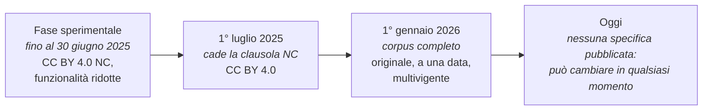
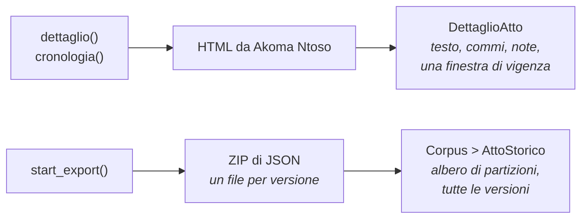

# Com'è fatto il servizio

Il servizio ha una forma sua, e da quella forma discendono diverse scelte della
libreria: i modelli sono due famiglie separate invece che una, le date passano
tutte da un unico punto di lettura, un URN da solo non basta a identificare un
atto. Qui c'è com'è fatto il servizio, e accanto a ogni sua particolarità che
cosa ne è seguito.

## Chi lo gestisce, e con che licenza

Normattiva è il portale della legge vigente dello Stato italiano. Il servizio è
curato dall'[Istituto Poligrafico e Zecca dello Stato](https://www.ipzs.it) per
conto della [Presidenza del Consiglio dei Ministri](https://www.governo.it),
della Camera dei Deputati e del Senato della Repubblica.

Accanto al portale di consultazione, IPZS pubblica lo stesso corpus come open
data su [dati.normattiva.it](https://dati.normattiva.it): archivi già
confezionati da scaricare e l'API HTTP con cui parla questa libreria, che
risponde senza chiave e senza registrazione. L'apertura è avvenuta per fasi, e
dal 1° gennaio 2026 copre tutti gli atti in tutte le versioni: le date e le
licenze di ciascuna fase stanno in [Licenza e
attribuzione](../progetto/licenza.md#con-che-licenza).

I dati sono in licenza [CC BY 4.0](https://creativecommons.org/licenses/by/4.0/deed.it),
quindi **l'attribuzione è obbligatoria**. Ogni modello della libreria la espone
già pronta:

```python
atto.attribuzione
# 'Fonte: Normattiva (https://www.normattiva.it), Istituto Poligrafico e Zecca
#  dello Stato, in licenza CC BY 4.0. Testo non autentico e gratuito: l'unico
#  testo ufficiale è quello pubblicato sulla Gazzetta Ufficiale a mezzo stampa.'
```

«Testo non autentico» vuol dire che quello di Normattiva è una ricostruzione
redazionale: le modifiche successive sono state applicate al testo originale da
una redazione, che può sbagliare. In caso di divergenza prevale il testo
stampato sulla Gazzetta Ufficiale. Deve saperlo anche chi legge quello che
costruisci con questi dati: vedi
[Licenza e attribuzione](../progetto/licenza.md).

## L'API può cambiare

L'indirizzo dell'API porta un `/v1`, ma quel numero non è un contratto: non
esiste una specifica pubblicata a cui il servizio si impegni, né un preavviso
per le modifiche. La forma delle risposte può cambiare sotto lo stesso numero
di versione, e il servizio si è già mosso più volte.



Perché un cambiamento non si scopra da un programma che smette di funzionare,
ogni notte una suite interroga tutti e quindici gli endpoint e confronta la
forma delle risposte con un riferimento registrato; a uno scostamento si apre
una issue sul repository. Il meccanismo è descritto in
[L'affidabilità](affidabilita.md#il-monitoraggio).

## Due modelli di risposta

Il servizio non ha un modello di dati unico: ne ha due, e la libreria li tiene
distinti.

**Il percorso interattivo** (`dettaglio`, `cronologia`) restituisce il testo di
**un atto o un articolo** in **una finestra di vigenza**. Arriva come HTML
generato da Akoma Ntoso, che la libreria scompone in testo piano, commi, note
di aggiornamento e formula introduttiva.

**L'esportazione** restituisce un **atto intero** con **tutte** le sue
versioni, in un archivio ZIP di documenti JSON strutturati ad albero.



Un modello unico richiederebbe campi opzionali fuorvianti: il testo sarebbe
presente per il percorso interattivo e assente per l'export, dove al suo posto
c'è l'articolato. Le due famiglie di modelli restano separate perché le due
risposte sono strutturalmente diverse. La tabella riassume le differenze:

|  | `DettaglioAtto` | `AttoStorico` |
|---|---|---|
| Da dove | percorso interattivo | esportazione |
| Cosa contiene | il testo di un atto o articolo a una data | l'atto intero, tutte le versioni |
| Struttura | testo piano più commi | albero di partizioni |
| Costo | una richiesta | circa un minuto |

## L'URN indirizza, non identifica

Un URN NIR indirizza un atto in modo affidabile, ma non lo identifica in modo
univoco: due provvedimenti distinti possono rispondere allo stesso URN, di
solito perché lo stesso numero è stato assegnato a due atti pubblicati in
Gazzette diverse.

In quel caso il servizio restituisce l'elenco dei candidati al posto dell'atto,
e la libreria lo trasforma in [`AmbiguityError`][normattiva.AmbiguityError],
che contiene i candidati.

Per il dettaglio, vedi [Un URN, due atti](trappole.md#un-urn-due-atti).

## Il testo è HTML, e le classi sono stabili

Il campo `articoloHtml` è markup generato da Akoma Ntoso. I nomi di classe sono
stabili, e questo permette di separare in modo affidabile quattro componenti:

- il testo dell'articolo, in `testo`
- le note redazionali di aggiornamento, accodate in fondo, in `note_aggiornamento`
- la formula introduttiva, in testa, in `preambolo`
- i commi numerati, in `commi`

Senza questa separazione, `atto.testo` conterrebbe anche il testo delle note, e
qualunque conteggio di parole o ricerca nel testo darebbe risultati falsati.

## Quattro formati di data, tre modi di dire «manca»

Nello stesso servizio, a seconda dell'endpoint, una data può arrivare in
quattro formati:

```
"1990-08-07"              ISO
"1990-08-07T00:00:00Z"    ISO con istante
"19900807"                compatta
"07/08/1990"              italiana
```

Anche i valori assenti hanno più rappresentazioni: stringa vuota, `"0"`, e
`"99999999"` quando la finestra non ha fine. La libreria le riconosce tutte e
restituisce una `date` oppure `None`, in un solo punto del codice, così nessun
altro modulo deve conoscere questi formati.

## Alcuni atti non dichiarano le proprie coordinate

La Costituzione ha anno, mese, giorno e numero tutti a **zero**, perché non è
un provvedimento numerato ed è datata solo dalla propria pubblicazione. La
libreria legge quello zero come un'assenza e usa la data di Gazzetta.

Sono valori che una `date` di Python non può rappresentare: senza questa
lettura, la Costituzione sarebbe l'unico atto del corpus che la libreria non
riesce a costruire.

## Gli endpoint

L'API open data espone quindici endpoint, e la libreria li copre tutti. La
corrispondenza fra metodi ed endpoint sta in
[Gli endpoint](../riferimento/endpoint.md).

### I criteri con due nomi

La ricerca avanzata e l'esportazione accettano gli stessi criteri, ma tre campi
cambiano nome da uno schema all'altro. Passare all'esportazione il nome usato
dalla ricerca non produce errori: quel filtro viene ignorato silenziosamente.
L'errore si scopre solo confrontando le due definizioni campo per campo, oppure
esportando due volte e contando gli atti.

La libreria traduce i nomi automaticamente. I tre campi sono elencati fra
[gli endpoint](../riferimento/endpoint.md#i-criteri-con-due-nomi).

## Cosa la libreria non espone

Alcuni campi presenti nella specifica non hanno un parametro nella libreria:
parametri che non hanno effetto, valori ammessi non documentati, un campo che
manderebbe l'archivio per posta elettronica. L'elenco sta fra
[gli endpoint](../riferimento/endpoint.md#i-campi-non-esposti), il criterio con
cui è stato compilato in [Perché la libreria fa così](scelte.md#che-cosa-non-viene-esposto).
