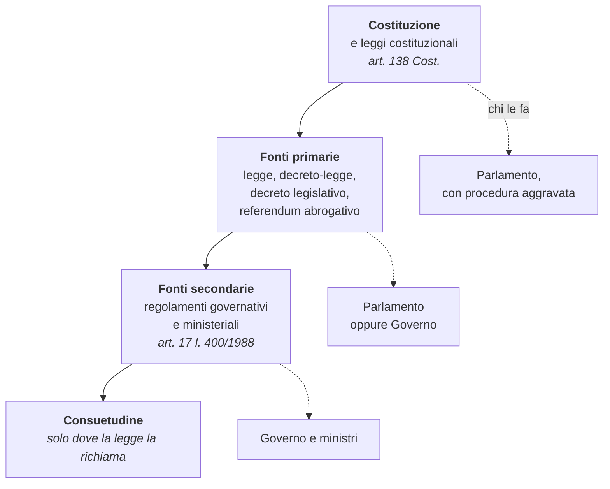
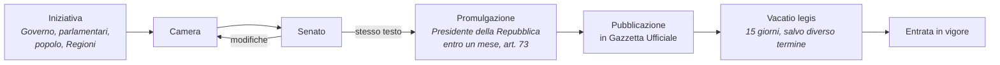
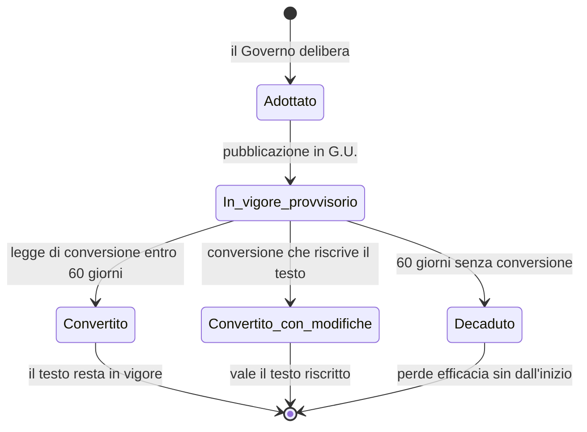
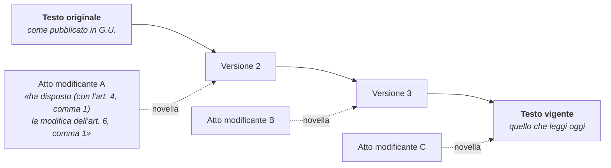

# Come funziona la normativa italiana

Il sistema che Normattiva rappresenta: chi produce le norme, che forma hanno,
come cambiano nel tempo e come si citano. Conoscerlo serve a leggere i dati con
cognizione di causa; per le conseguenze giuridiche di un testo la fonte è la
Gazzetta Ufficiale e l'interlocutore è un giurista.

## Che cosa c'è dentro Normattiva

Il corpus contiene gli atti normativi **dello Stato italiano**, dal 1861 a oggi.
Gli atti più vecchi sono regi decreti del Regno di Sardegna e poi del Regno
d'Italia, numerati anche in cifre romane:

```python
from datetime import date

esito = normattiva.ricerca_avanzata(emanazione=(date(1861, 1, 1), date(1861, 12, 31)))

print(esito.totale)
print(esito.atti[0].citazione)
```

```
669
R.D. 8 dicembre 1861, n. 408 novies
```

Numeri come `408 novies` o `MDCCXIV` sono la ragione per cui in questa libreria
il numero di un atto è una **stringa** e non un intero.

Non ci sono, e vanno cercate altrove:

| Che cosa | Dove sta |
|---|---|
| leggi e regolamenti **regionali** | banche dati delle singole Regioni |
| diritto dell'**Unione europea** | [EUR-Lex](https://eur-lex.europa.eu) |
| **sentenze** e altra giurisprudenza | banche dati giurisdizionali |
| atti amministrativi non normativi | Gazzetta Ufficiale, parte seconda |

## Chi produce le norme

Le fonti del diritto italiano sono ordinate in una gerarchia: quando due norme
si contraddicono, prevale quella di rango superiore, e una norma di rango
inferiore che contrasta con una superiore è invalida.



Il **rango** non dipende dal contenuto ma dalla forma dell'atto e da chi lo
adotta. Un decreto legislativo del Governo ha lo stesso rango di una legge del
Parlamento; un regolamento adottato con lo stesso strumento formale, il decreto
del Presidente della Repubblica, ha rango inferiore.

## Le fonti primarie

### La legge ordinaria

La funzione legislativa è esercitata **collettivamente dalle due Camere**
(art. 70 Cost.): un testo diventa legge solo quando Camera e Senato ne approvano
lo stesso identico articolato.



Il passaggio avanti e indietro fra le due Camere si chiama *navetta*, e non ha
un limite: finché il testo non è identico, la legge non c'è.

La legge 241 del 1990 mostra le date reali di questo percorso:

| Momento | Data | Dove si legge nella libreria |
|---|---|---|
| emanazione | 7 agosto 1990 | `atto.estremi.data` |
| pubblicazione in G.U. n. 192 | 18 agosto 1990 | `atto.gazzetta.data` |
| entrata in vigore | 2 settembre 1990 | `atto.finestra.inizio` della prima versione |

Fra pubblicazione ed entrata in vigore passano quindici giorni: è la **vacatio
legis** dell'art. 73 Cost., il tempo in cui la legge esiste ma non si applica
ancora. Alcune leggi la accorciano o la annullano dichiarando l'entrata in
vigore «il giorno stesso della pubblicazione».

### Il decreto-legge

Lo adotta il Governo in casi straordinari di necessità e urgenza (art. 77
Cost.). Entra in vigore subito, ma è **provvisorio**: se il Parlamento non lo
converte in legge entro sessanta giorni, perde efficacia *sin dall'inizio*, come
se non fosse mai esistito.



Il ramo di mezzo è quello che si incontra più spesso, ed è la ragione per cui i
decreti-legge hanno molte versioni ravvicinate: il testo che leggi oggi è quello
riscritto dalla legge di conversione, non quello adottato dal Governo. Con
`vigenza="originale"` si ottiene il testo di partenza.

### Il decreto legislativo

Lo adotta il Governo su **delega** del Parlamento (art. 76 Cost.). La legge
delega deve fissare in anticipo l'oggetto, i principi e criteri direttivi e il
termine entro cui il Governo può esercitarla. È la forma con cui si scrivono i
testi lunghi e tecnici: il codice dell'amministrazione digitale, il codice dei
contratti pubblici, il testo unico bancario.

### La legge costituzionale

Modifica la Costituzione e segue la procedura aggravata dell'art. 138: doppia
deliberazione di ciascuna Camera a distanza di almeno tre mesi, e se nella
seconda votazione non si raggiungono i due terzi, possibilità di referendum
confermativo.

## Le fonti secondarie

I **regolamenti** non possono contraddire la legge: la attuano, la specificano,
ne organizzano l'esecuzione. La legge 400 del 1988, all'articolo 17, ne fissa i
tipi e la forma:

| Atto | Chi lo adotta | Sigla |
|---|---|---|
| regolamento governativo | Governo, emanato dal Presidente della Repubblica | `D.P.R.` |
| decreto del Presidente del Consiglio | Presidente del Consiglio | `D.P.C.M.` |
| regolamento ministeriale | un ministro | `D.M.` |

La stessa sigla `D.P.R.` copre quindi atti di rango diverso: un D.P.R. può
contenere un regolamento oppure, come nel caso di un testo unico, norme di rango
primario adottate su delega. Quello che conta non è la sigla ma il fondamento su
cui l'atto è stato adottato.

## Come cambiano le norme

Un atto quasi mai viene sostituito in blocco: viene **modificato**, un pezzo
alla volta, da atti successivi.

**La novella** è la modifica che un atto nuovo apporta a un atto precedente.
Non è un testo autonomo: è un'istruzione di sostituzione, del tipo «all'articolo
19, comma 1, le parole X sono sostituite dalle parole Y». Applicando tutte le
novelle al testo originale si ottiene il **testo vigente**, che è quello che
Normattiva ricostruisce e pubblica.



Gli atti modificanti restano atti a sé: continuano a esistere, con il loro
numero e la loro data, e quello che hanno prodotto è la nuova versione dell'atto
modificato. `AttoStorico.aggiornamenti` contiene proprio queste istruzioni, con
le parole del servizio, e `atti_aggiornati` elenca gli atti che ne hanno
ricevuta una in un certo periodo.

**L'abrogazione** toglie efficacia a una norma per il futuro. L'articolo 15
delle *preleggi*, cioè le Disposizioni sulla legge in generale premesse al
codice civile, ne prevede tre forme: espressa, quando il legislatore lo dichiara; per
incompatibilità, quando la norma nuova contraddice la vecchia; per nuova
disciplina dell'intera materia. Un atto abrogato **resta consultabile** e resta
applicabile ai fatti avvenuti mentre era in vigore, ed è la ragione per cui
`AttoStorico.abrogato` è un'informazione e non un motivo per nascondere il testo.

**La deroga** non abroga: lascia in piedi la norma generale e le sottrae dei
casi. Per questo un testo può restare identico e cambiare significato quando
altrove compare una norma derogatoria.

Il risultato è che lo stesso articolo esiste in più versioni, ciascuna valida in
un periodo. L'articolo 19 della legge 241, la segnalazione certificata di inizio
attività, ne ha venti dal 1990 a oggi:

<div class="nrm-grafico" markdown="0">
<svg viewBox="0 0 760 200" xmlns="http://www.w3.org/2000/svg" role="img" aria-label="Le venti versioni dell'articolo 19 della legge 241 del 1990, dal 1990 a oggi, con la lunghezza del testo in caratteri" class="nrm-figura">
    <line x1="46" y1="121.9" x2="748" y2="121.9" class="nrm-griglia" />
  <text x="40" y="125.9" text-anchor="end" class="nrm-asse">2k</text>
  <line x1="46" y1="77.8" x2="748" y2="77.8" class="nrm-griglia" />
  <text x="40" y="81.8" text-anchor="end" class="nrm-asse">4k</text>
  <line x1="46" y1="33.6" x2="748" y2="33.6" class="nrm-griglia" />
  <text x="40" y="37.6" text-anchor="end" class="nrm-asse">6k</text>
  <path d="M 58.7 166.0 L 58.7 117.4 L 92.3 117.4 L 92.3 99.8 L 121.8 99.8 L 121.9 130.3 L 334.0 130.3 L 334.0 112.2 L 337.5 112.2 L 337.6 92.2 L 416.0 92.2 L 416.1 54.7 L 432.0 54.7 L 432.1 59.5 L 436.4 59.5 L 436.4 55.8 L 438.8 55.8 L 438.9 53.0 L 439.9 53.0 L 439.9 45.0 L 454.4 45.0 L 454.5 42.1 L 457.8 42.1 L 457.9 32.3 L 465.4 32.3 L 465.5 31.2 L 475.0 31.2 L 475.0 30.8 L 513.4 30.8 L 513.4 26.5 L 517.7 26.5 L 517.7 25.4 L 532.7 25.4 L 532.7 42.4 L 550.1 42.4 L 550.1 28.9 L 622.3 28.9 L 622.4 29.3 L 731.6 29.3 L 731.6 23.8 L 741.4 23.8 L 741.4 166.0 Z" class="nrm-area" />
  <line x1="58.7" y1="117.4" x2="58.7" y2="166.0" class="nrm-taglio" />
    <line x1="92.3" y1="99.8" x2="92.3" y2="166.0" class="nrm-taglio" />
    <line x1="121.9" y1="130.3" x2="121.9" y2="166.0" class="nrm-taglio" />
    <line x1="334.0" y1="112.2" x2="334.0" y2="166.0" class="nrm-taglio" />
    <line x1="337.6" y1="92.2" x2="337.6" y2="166.0" class="nrm-taglio" />
    <line x1="416.1" y1="54.7" x2="416.1" y2="166.0" class="nrm-taglio" />
    <line x1="432.1" y1="59.5" x2="432.1" y2="166.0" class="nrm-taglio" />
    <line x1="436.4" y1="55.8" x2="436.4" y2="166.0" class="nrm-taglio" />
    <line x1="438.9" y1="53.0" x2="438.9" y2="166.0" class="nrm-taglio" />
    <line x1="439.9" y1="45.0" x2="439.9" y2="166.0" class="nrm-taglio" />
    <line x1="454.5" y1="42.1" x2="454.5" y2="166.0" class="nrm-taglio" />
    <line x1="457.9" y1="32.3" x2="457.9" y2="166.0" class="nrm-taglio" />
    <line x1="465.5" y1="31.2" x2="465.5" y2="166.0" class="nrm-taglio" />
    <line x1="475.0" y1="30.8" x2="475.0" y2="166.0" class="nrm-taglio" />
    <line x1="513.4" y1="26.5" x2="513.4" y2="166.0" class="nrm-taglio" />
    <line x1="517.7" y1="25.4" x2="517.7" y2="166.0" class="nrm-taglio" />
    <line x1="532.7" y1="42.4" x2="532.7" y2="166.0" class="nrm-taglio" />
    <line x1="550.1" y1="28.9" x2="550.1" y2="166.0" class="nrm-taglio" />
    <line x1="622.4" y1="29.3" x2="622.4" y2="166.0" class="nrm-taglio" />
    <line x1="731.6" y1="23.8" x2="731.6" y2="166.0" class="nrm-taglio" />
  <line x1="46" y1="166.0" x2="748" y2="166.0" />
    <line x1="46.0" y1="166.0" x2="46.0" y2="170.0" />
  <text x="46.0" y="183.0" text-anchor="middle" class="nrm-asse">1990</text>
  <line x1="140.9" y1="166.0" x2="140.9" y2="170.0" />
  <text x="140.9" y="183.0" text-anchor="middle" class="nrm-asse">1995</text>
  <line x1="235.7" y1="166.0" x2="235.7" y2="170.0" />
  <text x="235.7" y="183.0" text-anchor="middle" class="nrm-asse">2000</text>
  <line x1="330.6" y1="166.0" x2="330.6" y2="170.0" />
  <text x="330.6" y="183.0" text-anchor="middle" class="nrm-asse">2005</text>
  <line x1="425.5" y1="166.0" x2="425.5" y2="170.0" />
  <text x="425.5" y="183.0" text-anchor="middle" class="nrm-asse">2010</text>
  <line x1="520.3" y1="166.0" x2="520.3" y2="170.0" />
  <text x="520.3" y="183.0" text-anchor="middle" class="nrm-asse">2015</text>
  <line x1="615.2" y1="166.0" x2="615.2" y2="170.0" />
  <text x="615.2" y="183.0" text-anchor="middle" class="nrm-asse">2020</text>
  <line x1="729.0" y1="166.0" x2="729.0" y2="170.0" />
  <text x="729.0" y="183.0" text-anchor="middle" class="nrm-asse">2026</text>
</svg>
</div>

Ogni gradino è una versione: l'altezza è la lunghezza del testo in caratteri, la
larghezza è il tempo in cui quella versione è rimasta in vigore. Il crollo del
1994 è una riscrittura che accorciò l'articolo a 1618 caratteri; la crescita del
2005 in poi lo ha portato oltre i 6000.

Il grafico si ottiene da `cronologia`, che restituisce le versioni una dopo
l'altra:

```python
for versione in normattiva.cronologia("urn:nir:stato:legge:1990-08-07;241~art19"):
    print(versione.finestra, len(versione.testo))
```

Da qui la **multivigenza**, e la ragione per cui in questa libreria quasi ogni
lettura accetta una data: vedi
[Leggere il testo a una data](../come-fare/leggere-il-testo-a-una-data.md).

## Testi unici e codici

Quando una materia è regolata da decine di atti stratificati, il legislatore la
raccoglie in un **testo unico**. Se il testo unico si limita a riordinare norme
esistenti è *compilativo*; se le riscrive è *innovativo*, e in quel caso è esso
stesso una fonte.

I **codici** sono la forma più estesa di questa operazione. I quattro codici
classici (civile, penale, di procedura civile, di procedura penale) sono stati
approvati negli anni Trenta e Quaranta con un regio decreto che li porta
**in allegato**: il regio decreto contiene due o tre articoli di approvazione, e
il codice vero e proprio è l'allegato.

Questa struttura è visibile nell'identificatore: l'articolo 2043 del codice
civile non risponde sotto l'URN del R.D. 262/1942, ma sotto il suo allegato 2.

```python
from normattiva import codici

codici.CODICE_CIVILE.articolo(2043)
# urn:nir:stato:regio.decreto:1942-03-16;262:2~art2043
#                                            ↑ allegato 2
```

Nello stesso regio decreto, l'allegato 1 contiene le preleggi:

```python
normattiva.dettaglio("urn:nir:stato:regio.decreto:1942-03-16;262:1~art12").testo
```

```
Art. 12.
(Interpretazione della legge).
Nell'applicare la legge non si può ad essa attribuire altro senso che quello
fatto palese dal significato proprio delle parole secondo la connessione di
esse, e dalla intenzione del legislatore. ...
```

I codici moderni, invece, sono decreti legislativi ordinari e non hanno
allegati: il codice dell'amministrazione digitale è il D.Lgs. 82/2005, e i suoi
articoli rispondono direttamente sotto quell'URN.

## Un atto per tipo, con il suo URN

Tutti gli identificatori di questa tabella sono stati verificati contro il
servizio.

| Tipo | Atto | URN |
|---|---|---|
| Costituzione | Costituzione della Repubblica | `urn:nir:stato:costituzione:1947-12-27` |
| Legge costituzionale | L. cost. 18 ottobre 2001, n. 3 | `urn:nir:stato:legge.costituzionale:2001-10-18;3` |
| Legge | L. 7 agosto 1990, n. 241 | `urn:nir:stato:legge:1990-08-07;241` |
| Decreto-legge | D.L. 17 marzo 2020, n. 18 | `urn:nir:stato:decreto.legge:2020-03-17;18` |
| Decreto legislativo | D.Lgs. 7 marzo 2005, n. 82 | `urn:nir:stato:decreto.legislativo:2005-03-07;82` |
| D.P.C.M. | D.P.C.M. 12 giugno 2026, n. 150 | `urn:nir:stato:decreto.del.presidente.del.consiglio.dei.ministri:2026-06-12;150` |
| Decreto ministeriale | D.M. 25 ottobre 1999, n. 471 | `urn:nir:stato:decreto.ministeriale:1999-10-25;471` |
| Regio decreto | R.D. 16 marzo 1942, n. 262 | `urn:nir:stato:regio.decreto:1942-03-16;262` |
| Articolo di un codice | art. 2043 c.c. | `urn:nir:stato:regio.decreto:1942-03-16;262:2~art2043` |
| Articolo con ordinale | art. 416-bis c.p. | `urn:nir:stato:regio.decreto:1930-10-19;1398:1~art416bis` |
| Articolo a una data | art. 19 l. 241/1990 nel 2000 | `urn:nir:stato:legge:1990-08-07;241~art19!vig=2000-01-01` |

!!! warning "Il D.P.R. 380/2001 è un caso di URN ambiguo"

    Il testo unico dell'edilizia risponde a
    `urn:nir:stato:decreto.del.presidente.della.repubblica:2001-06-06;380`, ma
    quell'URN corrisponde a **due** atti pubblicati su Gazzette diverse: la
    G.U. 245 del 20 ottobre 2001 e la G.U. 266 del 15 novembre 2001. La libreria
    solleva [`AmbiguityError`][normattiva.AmbiguityError] con i due candidati.

Come si compone un URN pezzo per pezzo sta in
[Identificare un atto](../come-fare/identificare-un-atto.md); la struttura
interna di un singolo atto in
[Come è fatto un atto](come-e-fatto-un-atto.md).
