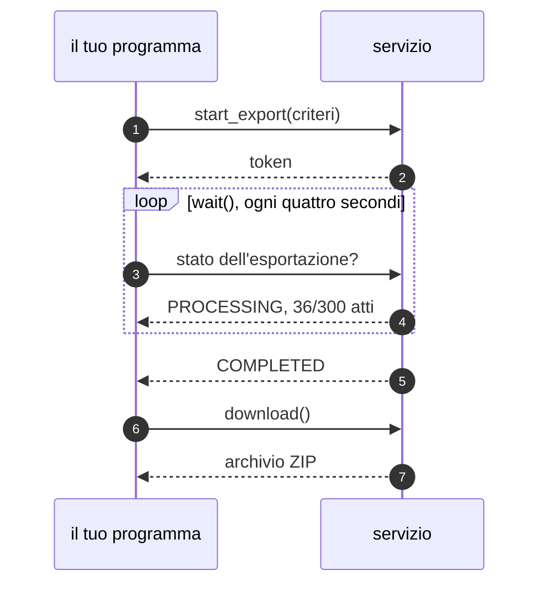

# Esportare un atto intero

`dettaglio` restituisce un articolo alla volta, a una data alla volta. Quando
serve un atto **intero**, con tutti i suoi articoli e tutte le versioni che ha
avuto, si usa l'esportazione.

La legge 241 del 1990 ha 61 versioni. Ricostruirle con `cronologia`, articolo
per articolo, costerebbe migliaia di richieste; un'esportazione le consegna
tutte in un archivio ZIP che si salva su disco e si rilegge senza rete.

## Come funziona

L'esportazione è l'unica parte dell'API che non risponde subito. Il servizio
apre un lavoro, lo mette in coda e ci mette circa un minuto a completarlo:

1. **`start_export`** manda i criteri e riceve un **token**. Il lavoro è
   partito dalla parte del servizio.
2. **`wait`** interroga il servizio ogni quattro secondi finché l'archivio è
   pronto.
3. **`download`** scarica il file e lo legge in modelli.



I tre passi restano separati perché fra l'uno e l'altro c'è spazio: durante
l'attesa il programma può fare altro, e il lavoro sopravvive al processo che lo
ha avviato, così un'esportazione interrotta si riprende dal token invece di
ricominciare.

```python
from normattiva import Normattiva

with Normattiva() as normattiva:
    esportazione = normattiva.start_export(anno=1990, numero=241)
    esportazione.wait()          # circa un minuto
    corpus = esportazione.download()

atto = corpus.atti[0]
print(atto.estremi.citazione)
print(len(atto.versioni), "versioni,", len(atto.aggiornamenti), "aggiornamenti")
```

```
L. 7 agosto 1990, n. 241
61 versioni, 60 aggiornamenti
```

Le versioni sono sempre una più degli aggiornamenti: la prima è il testo
originale, e ogni aggiornamento ne produce una nuova.

## Scegliere che cosa esportare

I criteri sono gli stessi di
[`ricerca_avanzata`](cercare-un-atto.md#cercare-per-coordinate), quindi
un'esportazione può prendere un atto solo o tutti quelli che una ricerca trova:

```python
from datetime import date

esportazione = normattiva.start_export(
    denominazione="DECRETO-LEGGE",
    emanazione=(date(2020, 3, 1), date(2020, 6, 30)),
    massimo_atti=60,
)
```

Due criteri esistono solo qui, e servono a togliere atti dal risultato:

```python
esportazione = normattiva.start_export(
    testo="amministrativo",
    escludi_testo="trasparenza",   # via gli atti che contengono questa parola
    escludi_titolo="regolamento",  # via quelli il cui titolo la contiene
)
```

### Quante versioni includere

```python
from normattiva import ExportMode

normattiva.start_export(anno=1990, numero=241, mode=ExportMode.MULTIVIGENTE)  # predefinito
normattiva.start_export(anno=1990, numero=241, mode=ExportMode.VIGENTE)
normattiva.start_export(anno=1990, numero=241, mode=ExportMode.ORIGINALE)
```

`MULTIVIGENTE` include tutte le versioni ed è il predefinito. `VIGENTE` include
solo il testo di oggi e `ORIGINALE` solo quello di prima pubblicazione: sono
archivi molto più piccoli, utili quando la storia non serve.

### Il limite qui rifiuta

`massimo_atti` conta gli atti **prima** di avviare l'esportazione e, se sono più
del limite, non la avvia affatto:

```python
from normattiva import TooManyResultsError

try:
    normattiva.start_export(denominazione="LEGGE")
except TooManyResultsError as errore:
    print(errore.totale, "atti, limite", errore.massimo)
```

```
32686 atti, limite 100
```

Il predefinito è cento. Per alzarlo, o per togliere del tutto il conteggio:

```python
normattiva.start_export(anno=2020, massimo_atti=500)
normattiva.start_export(anno=2020, massimo_atti=None)  # parte senza contare
```

È il contrario di `massimo` nella ricerca, che invece limita i risultati senza
rifiutare la richiesta: il perché sta in
[Perché la libreria fa così](../capire/scelte.md#limitare-o-rifiutare).

!!! note "Il conteggio non conosce le esclusioni"

    Il conteggio preventivo passa dalla ricerca sincrona, che `escludi_testo` ed
    `escludi_titolo` non li prevede. Può quindi contare più atti di quanti ne
    arriveranno davvero: per un limite di sicurezza una stima per eccesso va
    bene.

## Attendere

=== "Attesa bloccante"

    ```python
    stato = esportazione.wait()               # scadenza predefinita: dieci minuti
    stato = esportazione.wait(timeout=120)
    ```

    `wait` blocca il thread e interroga il servizio ogni quattro secondi.

=== "Ciclo tuo"

    ```python
    import time

    while not esportazione.refresh().done:
        print(esportazione.progress)
        time.sleep(5)
    ```

    `refresh` fa una domanda sola e restituisce lo stato, così il ritmo lo
    decidi tu.

=== "Asincrono"

    ```python
    esportazione = await normattiva.start_export(anno=1990, numero=241)
    await esportazione.wait()
    corpus = await esportazione.download()
    ```

    `AsyncExport` ha gli stessi metodi, e l'attesa passa da `asyncio.sleep`
    invece di bloccare il ciclo di eventi.

`progress` è un [`Progress`][normattiva.Progress] e stampa `'36/300 atti'`
quando il servizio manda il conteggio, `'12%'` quando manda solo la percentuale.
Il conteggio è più informativo: una percentuale ferma non distingue un lavoro
lento da un lavoro bloccato.

Gli stati possibili, e quali di questi concludono l'attesa, stanno in
[`ExportStatus`][normattiva.ExportStatus].

!!! trappola "Il ritardo dichiarato vale una proroga sola"

    Il servizio può rispondere `CONFIRMED_WITH_DELAY`, cioè «ci metterò più del
    previsto». La libreria concede una proroga pari alla scadenza, **una
    volta**: rinnovarla a ogni dichiarazione toglierebbe ogni limite all'attesa,
    e `wait(timeout=...)` non vorrebbe più dire niente.

## Riprendere da un token

Il lavoro sta sul servizio, non nel processo che lo ha chiesto:

```python
token = esportazione.token
salva_da_qualche_parte(token)

# in un altro processo, anche dopo un riavvio
esportazione = normattiva.export_from_token(token)
esportazione.wait()
corpus = esportazione.download()
```

`export_from_token` interroga subito lo stato, quindi si sa immediatamente se il
lavoro è ancora in corso o già pronto.

## Che cosa c'è dentro l'archivio

`download` restituisce un [`Corpus`][normattiva.Corpus], che contiene un
[`AttoStorico`][normattiva.AttoStorico] per ogni atto esportato:

```python
len(corpus)          # quanti atti
for atto in corpus:  # AttoStorico
    ...
```

Un `AttoStorico` è l'atto con tutta la sua storia:

```python
atto = corpus.atti[0]

str(atto.urn)             # 'urn:nir:stato:legge:1990-08-07;241'
atto.estremi.citazione    # 'L. 7 agosto 1990, n. 241'
atto.gazzetta             # G.U. n. 192 del 1990-08-18
atto.pubblicato_il        # datetime.date(1990, 8, 18)
atto.abrogato             # False
atto.versioni             # tutte, dalla più vecchia alla più recente
atto.aggiornamenti        # le modifiche, come le descrive il servizio
```

`abrogato` è un'informazione, non un motivo per nascondere il testo:
l'abrogazione toglie efficacia a un atto per il futuro, ma il testo abrogato
resta consultabile e resta applicabile ai fatti avvenuti mentre era in vigore.

Ogni [`Aggiornamento`][normattiva.Aggiornamento] descrive una modifica con le
parole del servizio:

```python
print(atto.aggiornamenti[0].data)
print(atto.aggiornamenti[0].testo)
```

```
2019-10-05
ha disposto (con l'art. 4, comma 1) la modifica dell'art. 6, comma 1, lettera e).
```

### La versione a una data

```python
from datetime import date

versione = atto.alla_data(date(2005, 1, 1))

versione.vigente_dal  # datetime.date(2004, 4, 29)
versione.originale    # False
```

`alla_data` restituisce l'ultima versione entrata in vigore **prima** della data
richiesta, che è quella che quel giorno era valida. Se la data precede la
pubblicazione dell'atto solleva
[`VersionNotFoundError`][normattiva.VersionNotFoundError].

Le due versioni agli estremi hanno una scorciatoia:

```python
atto.originale  # com'è stato pubblicato
atto.vigente    # la più recente contenuta nell'archivio
```

La versione originale nell'archivio non porta una data di inizio: quella è la
data di pubblicazione dell'atto, che sta su `atto.pubblicato_il`. Un atto mai
modificato ha una sola versione, e vale da allora.

### L'articolato

Ogni [`VersioneAtto`][normattiva.VersioneAtto] contiene un albero di
[`Partizione`][normattiva.Partizione]: libri, titoli, capi, articoli. Per
scendere direttamente agli articoli c'è `articoli()`:

```python
for articolo in atto.vigente.articoli():
    print(articolo.numero, "|", articolo.rubrica)
```

```
1 | Principi generali dell'attivita' amministrativa
2 | Conclusione del procedimento
2 bis | Conseguenze per il ritardo dell'amministrazione nella conclusione del procedimento.
3 | Motivazione del provvedimento
3 bis | Uso della telematica.
```

Il `numero` è una stringa, non un intero: `2 bis` è un numero di articolo del
tutto normale. La `rubrica` è il titolo dell'articolo.

!!! trappola "La rubrica manca quasi sempre nelle versioni vecchie"

    Nella legge 241 la versione vigente ha la rubrica su 50 articoli su 51.
    Quella in vigore nel 2005 ne ha **zero** su 34: il numero c'è sempre, il
    titolo dell'articolo no. Un programma che indicizza per rubrica perde tutta
    la storia più vecchia senza segnalare niente.

Gli **allegati** stanno in un ramo separato, `versione.annessi`, perché non
fanno parte dell'articolato e contarli insieme darebbe conteggi sbagliati. È
anche il ramo che contiene i codici: nell'export del codice civile, `articoli()`
[trova due articoli e non 3280](../capire/trappole.md#nellexport-di-un-codice-articoli-non-trova-gli-articoli).

!!! tip "Nell'export gli accenti sono vocale più apostrofo"

    Il testo dell'esportazione scrive `attivita'` dove il percorso interattivo
    scrive `attività`, come si vede nella rubrica dell'articolo 1 qui sopra: una
    ricerca sulla grafia corretta non troverebbe nulla. `normalize_accents` la
    rimette a posto:

    ```python
    from normattiva import normalize_accents

    normalize_accents("l'attivita' e' liberta'")
    # "l'attività è libertà"
    ```

    Che cosa lascia intatto, e perché, in
    [Le trappole](../capire/trappole.md#nellexport-gli-accenti-sono-vocale-piu-apostrofo).

## Salvare e riaprire

Un archivio scaricato si mette da parte e si rilegge senza toccare la rete:

```python
from normattiva import Corpus

corpus.save("241.zip")
riaperto = Corpus.from_zip("241.zip")
```

Su un atto voluminoso conviene: lo si scarica una volta e lo si interroga quante
volte serve, senza far ripartire un minuto di lavoro al servizio a ogni prova.

La struttura interna dell'archivio, e che cosa succede se la convenzione dei
nomi cambia, stanno nel
[riferimento](../riferimento/esportazione.md#il-formato-dellarchivio).

## Gli altri formati

Il servizio produce anche AKN, XML, PDF, EPUB, RTF e HTML. La libreria legge in
modelli **solo il JSON**; gli altri si scaricano come file:

```python
from normattiva import Format

esportazione = normattiva.start_export(anno=1990, numero=241, format=Format.AKN)
esportazione.wait()
esportazione.save("241-akn.zip")
```

Chiamare `download()` su un formato che la libreria non legge fallisce subito,
invece di consegnare un archivio che si scoprirebbe illeggibile più tardi:

```python
esportazione.download()
# InvalidArgumentError: il format AKN non viene letto in modelli:
# usare save() per scaricarlo come file
```

## Gli archivi già pronti

Alcune collezioni tematiche il servizio le tiene già confezionate, e non
richiedono nessuna attesa:

```python
for collezione in normattiva.collections():
    print(collezione.name, collezione.total_atti, collezione.created_at)

normattiva.save_collection("Leggi di delegazione europea", "delega.zip")
```

!!! trappola "`download_collection` restituisce un archivio vuoto"

    È un difetto del servizio, non della libreria: finché dura, quelle
    collezioni si prendono con `save_collection`, che scrive il file su disco.
    Vedi [Le trappole](../capire/trappole.md#lo-scarico-sincrono-delle-collezioni-e-rotto).
