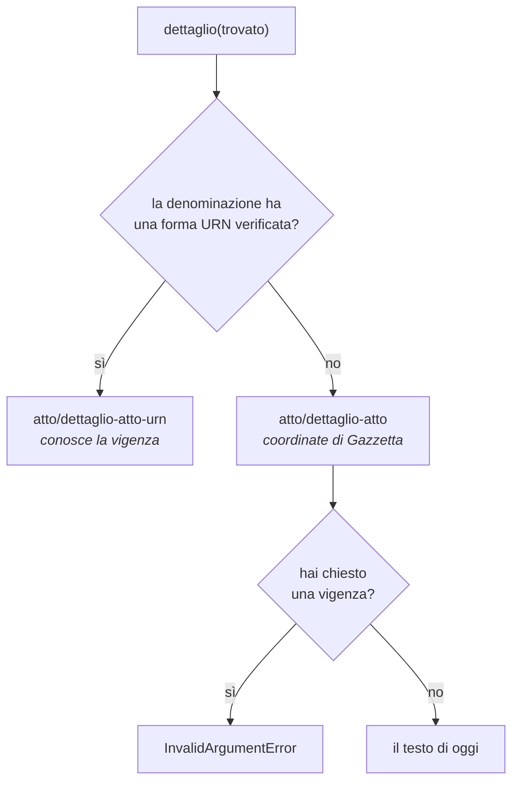

# Identificare un atto

Per chiedere un atto a Normattiva serve il suo indirizzo, che è un **URN NIR**,
lo schema con cui le norme italiane si citano fra loro:

```
urn:nir:stato:legge:1990-08-07;241~art1
```

Si legge «articolo 1 della legge dello Stato del 7 agosto 1990, numero 241».
L'elenco delle parti di cui è composto sta nel
[riferimento](../riferimento/urn.md#le-parti-di-un-urn).

La forma è rigida e il servizio non aiuta a scoprirlo: un separatore fuori
posto, una data sbagliata o un allegato mancante producono un `404`, che è la
stessa risposta che si riceve per un atto inesistente. Per questo conviene far
comporre l'URN alla libreria invece di scriverlo a mano.

## Comporlo con i costruttori

Per i cinque tipi di atto più comuni ci sono costruttori che mettono i pezzi al
posto giusto:

```python
from datetime import date

from normattiva import Urn

print(Urn.legge(1990, 241))
print(Urn.legge(1990, 241, data=date(1990, 8, 7)))
print(Urn.decreto_legge(2020, 18))
print(Urn.decreto_legislativo(2005, 82))
print(Urn.dpr(2001, 380, articolo="6bis"))
print(Urn.regio_decreto(1942, 262))
```

```
urn:nir:stato:legge:1990;241
urn:nir:stato:legge:1990-08-07;241
urn:nir:stato:decreto.legge:2020;18
urn:nir:stato:decreto.legislativo:2005;82
urn:nir:stato:decreto.del.presidente.della.repubblica:2001;380~art6bis
urn:nir:stato:regio.decreto:1942;262
```

Numeri e articoli si passano come interi o come stringhe, indifferentemente:
`Urn.legge(1990, 241)` e `Urn.legge(1990, "241")` producono lo stesso URN.

### La data serve o no?

Entrambe le forme rispondono. Quella con la data è più precisa, e serve quando
in uno stesso anno esistono due atti con lo stesso numero, cosa che succede più
spesso di quanto sembri: senza data quell'URN corrisponde a due atti distinti e
la libreria solleva `AmbiguityError` invece di sceglierne uno.

### Gli articoli con l'ordinale

Quando una modifica inserisce un articolo nuovo fra il 2 e il 3, gli articoli
successivi non vengono rinumerati: si aggiunge un **2-bis**, poi un 2-ter, e
avanti con gli ordinali latini. Nell'URN si scrivono attaccati e senza trattino:

```python
Urn.legge(1990, 241, articolo="5bis")   # va bene
Urn.legge(1990, 241, articolo="5BIS")   # normalizzato in 5bis
Urn.legge(1990, 241, articolo="5-bis")  # rifiutato
```

```
InvalidUrnError: URN non valido: '5-bis' (numero di articolo non riconosciuto)
```

Il trattino viene rifiutato in locale, prima della richiesta, perché il servizio
non lo accetta e risponderebbe con lo stesso `404` indistinguibile di sempre.

## Leggere un URN che arriva da fuori

`Urn.parse` accetta la forma testuale e la scompone:

```python
from normattiva import Urn

urn = Urn.parse("urn:nir:stato:legge:1990-08-07;241~art5")

urn.denominazione  # 'legge'
urn.anno           # 1990
urn.data           # datetime.date(1990, 8, 7)
urn.numero         # '241'
urn.articolo       # '5'
urn.allegato       # None
```

Se la stringa non è un URN valido, l'errore arriva subito, senza toccare la
rete:

```python
from normattiva import InvalidUrnError

try:
    Urn.parse("urn:nir:stato:legge:1990-02-30;241")
except InvalidUrnError as errore:
    print(errore)
    print(errore.testo, "|", errore.motivo)
```

```
URN non valido: '1990-02-30' (data inesistente)
1990-02-30 | data inesistente
```

`testo` è il pezzo che non va e `motivo` la ragione, quando la libreria sa
qual è. Su una stringa che non somiglia affatto a un URN, `motivo` resta `None`.

## Modificarne un pezzo

`Urn` è immutabile: i metodi che sembrano modificarlo restituiscono un URN
nuovo, e quello di partenza resta com'era.

```python
legge = Urn.legge(1990, 241)

legge.con_articolo(19)                             # ~art19
legge.con_articolo(19).con_vigenza(date(2000, 1, 1))  # !vig=2000-01-01
legge.con_vigenza("originale")                     # @originale
```

`permalink` restituisce il link pubblico alla pagina di Normattiva, quello da
mettere in un documento perché chi legge possa verificare sulla fonte:

```python
Urn.legge(1990, 241, articolo=1).permalink
# 'https://www.normattiva.it/uri-res/N2Ls?urn:nir:stato:legge:1990;241~art1'
```

## Il comma si porta ma non si chiede

I rimandi dentro il testo restituito dal servizio arrivano spesso con il comma
attaccato, e `Urn` lo sa leggere e conservare. Il servizio però **rifiuta** un
URN che gli arriva col comma:

```python
citazione = Urn.parse("urn:nir:stato:legge:2007-12-24;244~art2-com428")

citazione.comma        # '428'
citazione.senza_comma  # urn:nir:stato:legge:2007-12-24;244~art2
```

`dettaglio` toglie il comma da sé prima di fare la richiesta, quindi non è una
cosa di cui doversi ricordare. `senza_comma` serve quando l'URN lo maneggi tu,
per esempio per costruire un link o una chiave di cache.

## I codici

Un articolo del codice civile non risponde sotto l'URN del regio decreto che lo
ha approvato. Risponde sotto un suo **allegato**:

```python
from normattiva import Normattiva, codici

with Normattiva() as normattiva:
    art = normattiva.dettaglio(codici.CODICE_CIVILE.articolo(2043))

print(codici.CODICE_CIVILE.articolo(2043))
print(art.testo)
```

```
urn:nir:stato:regio.decreto:1942-03-16;262:2~art2043
Art. 2043.
(Risarcimento per fatto illecito).
Qualunque fatto doloso o colposo, che cagiona ad altri un danno ingiusto,
obbliga colui che ha commesso il fatto a risarcire il danno.
```

Il `:2` prima dell'articolo è l'allegato. Il codice civile è l'allegato 2 del
R.D. 262/1942, il codice penale è l'allegato 1 del R.D. 1398/1930, il codice di
procedura penale non ha allegato. Non c'è una regola da applicare, e dedurre
l'allegato per analogia porta a un `404`.

`codici` conosce l'allegato di dodici atti fra i più citati. L'elenco, con la
citazione di ciascuno, sta nel [riferimento](../riferimento/codici.md); per
scorrerlo da codice:

```python
for atto in codici.tutti():
    print(f"{atto.nome:45} {atto.urn}")
```

Se il codice che ti serve non è nell'elenco, cercalo con `ricerca` e usa l'URN
che il servizio stesso restituisce, invece di comporlo per tentativi.

## Dal risultato di una ricerca all'URN

Ogni [`AttoTrovato`][normattiva.AttoTrovato] espone `urn`, ricavato dalle sue
coordinate. Per certi tipi di atto, però, la libreria non sa comporlo:

```python
for trovato in normattiva.ricerca_completa("bonifica", massimo=20):
    if trovato.ha_urn:
        print(trovato.urn)
    else:
        print(trovato.citazione, "(URN non componibile)")
```

Sono dodici denominazioni su trenta, quasi tutte storiche: «regolamento»,
«decreto del Duce», «regio decreto-legge». Per quelle `urn` solleva
[`InvalidUrnError`][normattiva.InvalidUrnError] invece di comporre un
identificatore che il servizio rifiuterebbe, e `ha_urn` permette di saperlo
prima.

Restano comunque leggibili: `dettaglio` accetta l'`AttoTrovato` e per quegli
atti passa dalle coordinate di Gazzetta, che il servizio accetta altrettanto
bene.

```python
atto = normattiva.dettaglio(trovato)
```



La strada di Gazzetta non conosce le date: una `vigenza` chiesta per un atto
raggiungibile solo così solleva
[`InvalidArgumentError`][normattiva.InvalidArgumentError], perché ignorarla
restituirebbe il testo di oggi facendolo passare per quello storico.

## Citare un atto

`citazione` scrive l'atto nella forma usata dai giuristi:

```python
from datetime import date

from normattiva import EstremiAtto

print(EstremiAtto("LEGGE", date(1990, 8, 7), "241").citazione)
print(EstremiAtto("REGIO DECRETO-LEGGE", date(1935, 1, 13), "1").citazione)
```

```
L. 7 agosto 1990, n. 241
R.D.L. 13 gennaio 1935, n. 1
```

Le abbreviazioni conosciute sono undici e le forme URN diciotto, e i due insiemi
non coincidono: il regio decreto-legge si abbrevia ma non si indirizza, mentre
otto tipi si indirizzano senza avere un'abbreviazione. Un tipo senza
abbreviazione si cita per esteso. La tabella completa sta in
[come è fatto un atto](../capire/come-e-fatto-un-atto.md#le-abbreviazioni).

Nella pratica si scrive poi «art. 2, comma 1, l. 241/1990». La libreria si ferma
alla citazione dell'atto, l'unica parte per cui esiste una convenzione davvero
condivisa.
