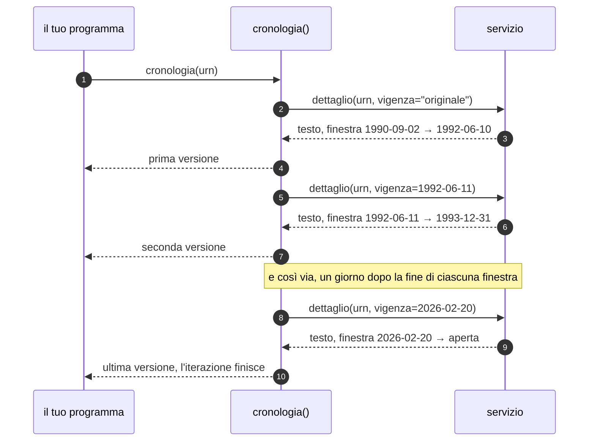

# Leggere il testo a una data

Il testo di una legge cambia nel tempo. Normattiva conserva ogni versione, e
`dettaglio` restituisce quella in vigore in un giorno preciso.

## Chiedere il testo di un giorno preciso

L'esempio è completo: si incolla in un file e si esegue.

```python
from datetime import date

from normattiva import Normattiva

with Normattiva() as normattiva:
    atto = normattiva.dettaglio(
        "urn:nir:stato:legge:1990-08-07;241~art19", vigenza=date(2000, 1, 1)
    )

print(atto.finestra)
print(atto.finestra.inizio, atto.finestra.fine)
print(atto.finestra.aperta)
print(atto.testo[:60])
```

```
1994-01-01 → 2005-03-07
1994-01-01 2005-03-07
False
Art. 19
((1. In tutti i casi in cui l'esercizio di un'attività
```

`vigenza` accetta un `datetime.date`. Il servizio non restituisce il testo «del
1° gennaio 2000»: restituisce la versione dell'articolo che quel giorno era in
vigore, insieme all'intervallo in cui quella versione è rimasta valida.

Quell'intervallo è la **finestra di vigenza**, ed è un
[`FinestraVigenza`][normattiva.FinestraVigenza]:

| Attributo | Tipo | Che cos'è |
|---|---|---|
| `inizio` | `date` | il primo giorno in cui questa versione è stata in vigore |
| `fine` | `date \| None` | l'ultimo giorno, oppure `None` se è ancora in vigore |
| `aperta` | `bool` | `True` quando `fine` è `None` |
| `contiene(giorno)` | `bool` | se quel giorno cade dentro la finestra |

Nell'esempio la finestra va dal 1° gennaio 1994 al 7 marzo 2005: la data che
abbiamo chiesto sta in mezzo, e nessuno dei due estremi coincide con essa. È
normale, ed è l'informazione più utile della risposta: dice che quel testo era
già in vigore da sei anni e lo sarebbe rimasto per altri cinque.

!!! tip "Conserva la finestra insieme al testo"

    Un testo salvato senza la sua finestra non è più interpretabile: fra sei
    mesi nessuno saprà a quale versione corrisponde. `finestra.inizio` è anche
    la data da ripassare a `dettaglio` per rileggere esattamente quella
    versione.

## Confrontare due date

`dettaglio` va chiamato una volta per data. Le due chiamate sono indipendenti e
si possono fare nello stesso blocco:

```python
from datetime import date

from normattiva import Normattiva

URN = "urn:nir:stato:legge:1990-08-07;241~art19"

with Normattiva() as normattiva:
    versioni = {
        anno: normattiva.dettaglio(URN, vigenza=date(anno, 1, 1))
        for anno in (2000, 2015, 2024)
    }

for anno, atto in versioni.items():
    print(anno, atto.finestra, len(atto.testo), "caratteri")
```

```
2000 1994-01-01 → 2005-03-07 1618 caratteri
2015 2014-11-12 → 2015-08-27 6376 caratteri
2024 2020-05-19 → 2026-02-19 6198 caratteri
```

L'articolo 19 della legge 241, la segnalazione certificata di inizio attività,
è passato da 1618 a oltre 6000 caratteri in vent'anni, e le tre versioni sono
rimaste in vigore per periodi molto diversi: undici anni la prima, nove mesi la
seconda.

Una finestra senza fine è **aperta**: `fine` vale `None`, `aperta` vale `True` e
la libreria la stampa come `oggi`. Nessuna delle tre qui sopra lo è, perché
anche la versione del 2024 è stata poi sostituita.

## Il testo come fu pubblicato

Al posto di una data, `vigenza` accetta la stringa `"originale"`:

```python
originale = normattiva.dettaglio(URN, vigenza="originale")
```

Restituisce l'atto come è uscito in Gazzetta Ufficiale, prima di qualunque
modifica. È l'unico valore non-data ammesso.

## Senza data si ottiene il testo di oggi

```python
oggi = normattiva.dettaglio(URN)
```

La chiamata è legittima e non produce nessun avviso. Va però tenuto presente
che nella risposta **non c'è niente** che dica «questo è il testo del giorno in
cui l'hai chiesto»: `finestra.inizio` è la data dell'ultima modifica, che può
essere di anni fa, e `finestra.fine` è `None`.

Se il testo va conservato, la data di lettura va aggiunta da chi lo conserva:

```python
salva(
    testo=oggi.testo,
    valido_dal=oggi.finestra.inizio,
    letto_il=date.today(),
)
```

## Percorrere tutte le versioni

`cronologia` restituisce le versioni una dopo l'altra, dalla prima pubblicazione
a quella in vigore oggi:

=== "Sincrono"

    ```python
    for versione in normattiva.cronologia(URN, massimo=5):
        print(versione.finestra, len(versione.testo))
    ```

=== "Asincrono"

    ```python
    async for versione in normattiva.cronologia(URN, massimo=5):
        print(versione.finestra, len(versione.testo))
    ```

```
1990-09-02 → 1992-06-10 2205
1992-06-11 → 1993-12-31 3001
1994-01-01 → 2005-03-07 1618
2005-03-08 → 2005-05-14 2440
2005-05-15 → 2009-07-03 3344
```

Ogni elemento è un [`DettaglioAtto`][normattiva.DettaglioAtto] completo, con il
testo e i commi di quella versione: `cronologia` è un iteratore, non un elenco
di date.

**Costa una richiesta per versione.** Il servizio non espone un elenco delle
versioni di un articolo, quindi la libreria lo ricostruisce saltando di finestra
in finestra:



La catena si chiude quando arriva una finestra senza fine. L'articolo 19 ha 20 versioni,
cioè 20 richieste, che alle due al secondo che la libreria si impone fanno una
decina di secondi. Un atto intero, dove ogni articolo ha la sua storia, costa
molto di più: per quello c'è l'esportazione.

`massimo` ferma l'iterazione prima:

```python
prime_cinque = list(normattiva.cronologia(URN, massimo=5))
```

!!! warning "Senza `massimo` la catena si ferma dopo cinquecento passi"

    Oltre quel numero `cronologia` solleva
    [`UnexpectedResponseError`][normattiva.UnexpectedResponseError]. Nessun
    articolo italiano ha cinquecento versioni: una catena così lunga vuol dire
    che le finestre hanno smesso di essere contigue, e la ricostruzione non
    troverebbe mai la fine.

## Quando la data cade fuori

Due situazioni diverse, due errori diversi.

**L'articolo non esisteva ancora.** Gli articoli aggiunti da una modifica
successiva non hanno versioni prima di quella modifica:

```python
from normattiva import NotYetInForceError, codici

try:
    normattiva.dettaglio(codici.CODICE_PENALE.articolo("416bis"), vigenza=date(1975, 1, 1))
except NotYetInForceError as errore:
    print(errore)
    print(errore.vigente_dal)
```

```
l'articolo non era ancora in vigore alla data richiesta (in vigore dal 1982-09-29)
1982-09-29
```

L'articolo 416-bis del codice penale, l'associazione di tipo mafioso, è stato
introdotto nel 1982 dalla legge Rognoni-La Torre: nel 1975 non esisteva.
`vigente_dal` dice da quando esiste, quando il servizio manda l'informazione.

**Il servizio ha risposto con la versione sbagliata.** La libreria controlla che
la finestra restituita contenga davvero la data richiesta, e in caso contrario
solleva [`ValidityMismatchError`][normattiva.ValidityMismatchError] invece di
restituire il testo. Oggi non capita: se capitasse, vorrebbe dire che il
servizio ha cambiato comportamento e che i testi storici già raccolti vanno
riguardati.

## Le date che il servizio accetterebbe

Il servizio accetta date inesistenti, il 30 febbraio compreso, e invece di
rifiutarle risponde qualcosa. Lavorando con oggetti `date` il problema non si
pone, perché il 30 febbraio non è rappresentabile, e `Urn.parse` scarta le date
impossibili prima di fare la richiesta. Restano scoperte solo le stringhe URN
costruite a mano e usate altrove.

## Quando conviene l'esportazione

`dettaglio` e `cronologia` lavorano su **un articolo alla volta**. Per un atto
intero, con tutti i suoi articoli e tutte le loro versioni, una singola
esportazione costa meno di centinaia di richieste, produce un archivio che si
salva su disco e non tronca gli articoli lunghi, che sul percorso interattivo
arrivano tagliati a cento commi.

Vedi [Esportare un atto intero](esportare-un-atto.md).
