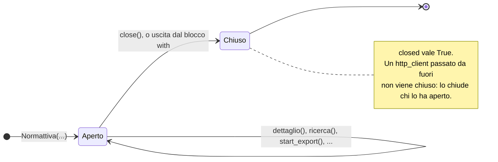

# Il client sincrono

`Normattiva` è la classe da cui passa tutto: tiene aperta la connessione HTTP
verso l'API, il limitatore di richieste e la politica dei retry, ed espone un
metodo per ogni endpoint. Si costruisce una volta e si riusa, meglio se dentro
un `with`, che la chiude a fine blocco.

```python
from normattiva import Normattiva

with Normattiva() as normattiva:
    atto = normattiva.dettaglio("urn:nir:stato:legge:1990-08-07;241~art2")
```



Per l'uso asincrono c'è [`AsyncNormattiva`](client-asincrono.md), che rispecchia
questa classe metodo per metodo e firma per firma.

::: normattiva.Normattiva
