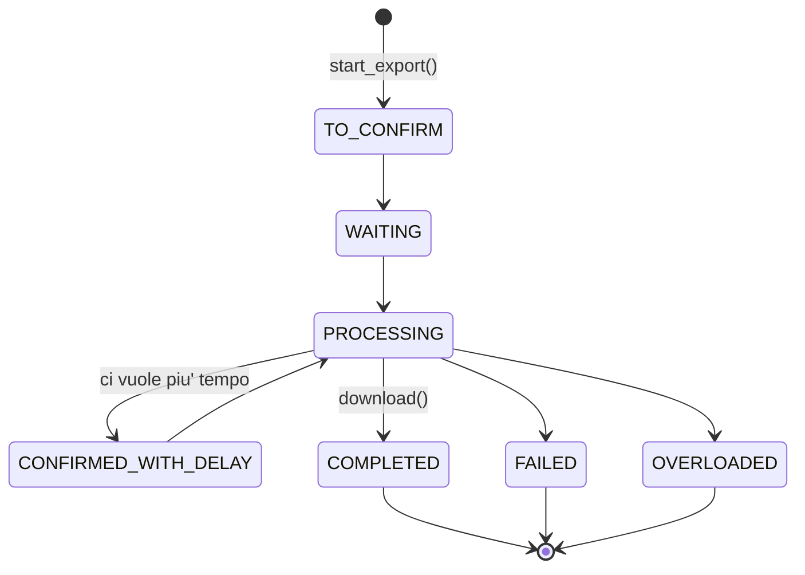

# L'esportazione

Un'esportazione è un lavoro che gira dalla parte del servizio: `Export` lo
rappresenta mentre è in corso, `ExportStatus` dice a che punto è, `Progress`
quanto ne resta, e `Corpus` è l'archivio una volta scaricato. `Export` sta
in piedi da solo, identificato dal suo token, e sopravvive al processo che
l'ha avviato.

Il percorso completo, dai criteri all'archivio riaperto da disco, sta in
[esportare un atto intero](../come-fare/esportare-un-atto.md).

## Gli stati di un'esportazione



I tre stati in fondo concludono l'attesa di `wait`; gli altri la fanno tornare
a interrogare il servizio.

## Il formato dell'archivio

Un ZIP con una cartella per atto, e dentro un documento JSON per versione:

```
LEGGE_19900807_241/1990-08-18_090G0294_ORIGINALE_V0.json
LEGGE_19900807_241/1990-08-18_090G0294_VIGENZA_1990-12-20_V1.json
LEGGE_19900807_241/1990-08-18_090G0294_VIGENZA_1991-01-23_V2.json
```

Il nome porta la data di pubblicazione in Gazzetta, il codice redazionale, la
data da cui la versione vale e il suo numero progressivo. Nessun campo del
documento riporta quella data: se i nomi non dichiarano la versione, `Corpus`
rifiuta l'archivio con
[`UnexpectedResponseError`][normattiva.UnexpectedResponseError] invece di
leggerli tutti come «originale».

::: normattiva.Export

::: normattiva.AsyncExport

::: normattiva.ExportStatus

::: normattiva.Progress

::: normattiva.Corpus
