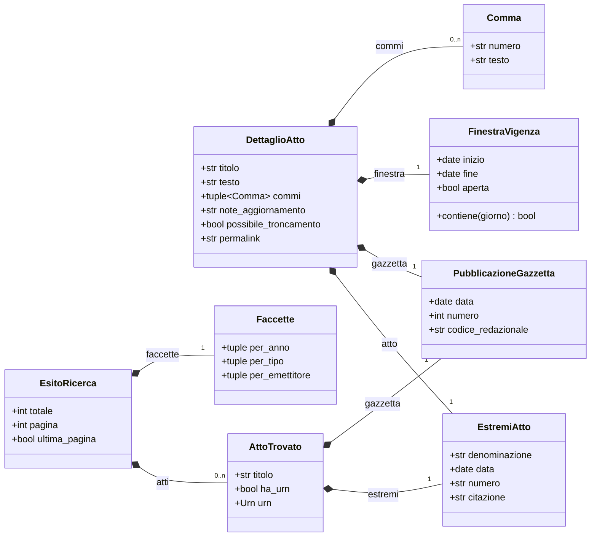
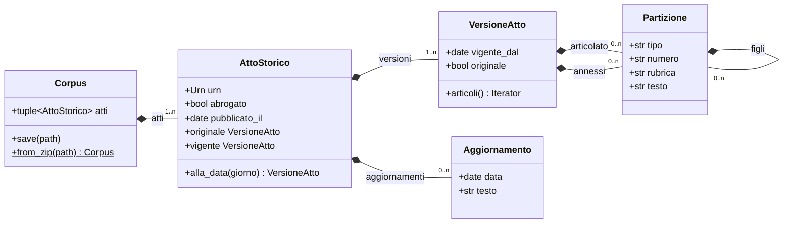

# I modelli

Tutti i modelli sono `dataclass` **congelate**: non si modificano dopo la
costruzione, si hashano e si confrontano per valore. Nessuno di questi va
costruito a mano nell'uso normale: arrivano dalle risposte del servizio.

## Quale oggetto arriva da quale chiamata

| Chiamata | Restituisce | Contiene |
|---|---|---|
| [`dettaglio`][normattiva.Normattiva.dettaglio] | `DettaglioAtto` | il testo di un atto o articolo in una finestra di vigenza |
| [`cronologia`][normattiva.Normattiva.cronologia] | iteratore di `DettaglioAtto` | una versione per volta, dalla più vecchia |
| [`ricerca`][normattiva.Normattiva.ricerca], [`ricerca_avanzata`][normattiva.Normattiva.ricerca_avanzata] | `EsitoRicerca` | una pagina di `AttoTrovato`, più totale e faccette |
| [`ricerca_completa`][normattiva.Normattiva.ricerca_completa] | iteratore di `AttoTrovato` | gli atti di tutte le pagine, uno per volta |
| [`atti_aggiornati`][normattiva.Normattiva.atti_aggiornati] | iteratore di `AttoTrovato` | gli atti modificati nel periodo |
| [`start_export`][normattiva.Normattiva.start_export] | `Export` | il lavoro in corso, con il suo token |
| [`Export.download`][normattiva.Export.download] | `Corpus` | un `AttoStorico` per atto, con tutte le versioni |
| [`denominazioni`][normattiva.Normattiva.denominazioni] e le altre tipologiche | tupla di `Tipologica` | i codici che i criteri accettano |
| [`collections`][normattiva.Normattiva.collections] | tupla di `Collection` | gli archivi già confezionati |

Dall'esportazione arriva invece un albero, dove `Partizione` contiene sé stessa:

I due percorsi producono modelli diversi perché le due risposte del servizio
sono strutturalmente diverse: `DettaglioAtto` porta testo e commi di **una**
versione, `AttoStorico` porta l'albero dell'articolato di **tutte**. Il
confronto sta in
[Com'è fatto il servizio](../capire/il-servizio.md#due-modelli-di-risposta).

## Il testo di un atto o di un articolo

::: normattiva.DettaglioAtto

::: normattiva.Comma

## Le coordinate di un atto

::: normattiva.EstremiAtto

::: normattiva.PubblicazioneGazzetta

::: normattiva.FinestraVigenza

## I risultati di una ricerca

::: normattiva.EsitoRicerca

::: normattiva.AttoTrovato

::: normattiva.Evidenziazione

::: normattiva.Faccette

::: normattiva.Faccetta

## L'atto intero, dall'esportazione

::: normattiva.AttoStorico

::: normattiva.VersioneAtto

::: normattiva.Partizione

::: normattiva.Aggiornamento

::: normattiva.RiferimentoAggiornamento

## I dizionari del servizio

::: normattiva.Tipologica

::: normattiva.Collection

::: normattiva.RicercaPredefinita

## Le enumerazioni

::: normattiva.Format

::: normattiva.ExportMode

::: normattiva.ClasseProvvedimento

::: normattiva.Sort

## Le costanti

::: normattiva.modelli.ATTRIBUZIONE

::: normattiva.modelli.DENOMINAZIONI_URN

::: normattiva.modelli.ABBREVIAZIONI

::: normattiva.modelli.ARTICOLO
